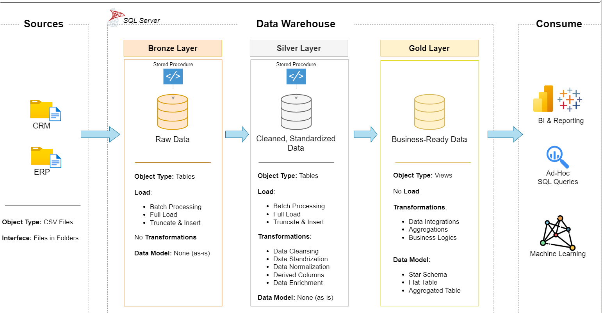

# 🚀 Data Warehouse and Analytics Project

Welcome to the **Data Warehouse and Analytics Project**!  
This project demonstrates an end-to-end data warehousing solution, from raw data ingestion to generating actionable insights.

It is designed as a **portfolio project** to showcase real-world skills in **Data Engineering, SQL Development, and Analytics**.

---

## 🏗️ Data Architecture

 

This project follows the **Medallion Architecture** approach:

### 🥉 Bronze Layer (Raw Data)
- Stores raw data as-is from source systems  
- Data is ingested from CSV files into SQL Server  
- No transformations applied  

### 🥈 Silver Layer (Cleaned Data)
- Data cleansing and standardization  
- Handling missing values  
- Data normalization  
- Prepared for analysis  

### 🥇 Gold Layer (Business Layer)
- Business-ready data  
- Modeled using a **Star Schema**  
- Optimized for reporting and analytics  

---

## 📖 Project Overview

This project includes:

### 🔹 Data Architecture
- Designed a scalable data warehouse using Medallion Architecture  
- Organized data into Bronze, Silver, and Gold layers  

### 🔹 ETL Pipelines
- Extracted data from CSV files  
- Applied transformations and cleaning  
- Loaded into SQL Server  

### 🔹 Data Modeling
- Built **Fact and Dimension tables**  
- Designed schemas optimized for analytical queries  

### 🔹 Analytics & Reporting
- Developed SQL-based reports  
- Generated actionable insights  
- Enabled reporting-ready datasets  

---

## 🛠️ Tech Stack

- SQL Server  
- T-SQL  
- CSV (Data Source)  
- SSMS (SQL Server Management Studio)  

---

## 📊 Key Concepts Demonstrated

- Medallion Architecture  
- Data Warehousing Design  
- ETL Pipeline Development  
- Star Schema Modeling  
- Data Transformation & Cleaning  
- Window Functions  

---

## 🎯 Who is this project for?

This project is ideal for:

- Data Engineers  
- Data Analysts  
- SQL Developers  
- Aspiring Data Architects  
- Students building portfolio projects  

---

## 📌 How to Use

1. Clone the repository  
2. Open SQL Server Management Studio (SSMS)  
3. Execute scripts in order:
   - Bronze layer  
   - Silver layer  
   - Gold layer  
4. Run analytical queries  

---

## 📈 Future Improvements

- Add orchestration (Airflow / Azure Data Factory)  
- Integrate BI tools (Power BI / Tableau)  
- Implement incremental loading  
- Add data quality checks  

---

## ⭐ Final Note

This project reflects **real-world data engineering practices** and is designed to showcase skills required for modern data roles.

If you found this useful, feel free to ⭐ the repository!
